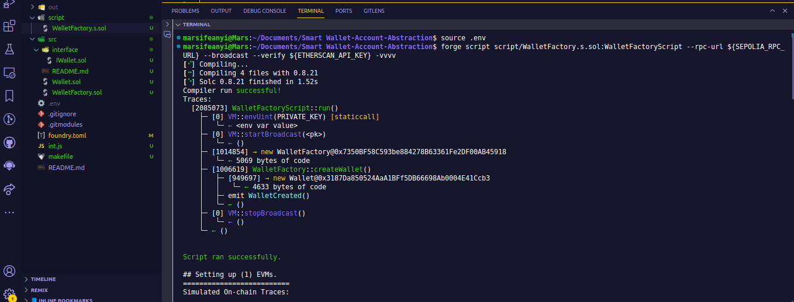
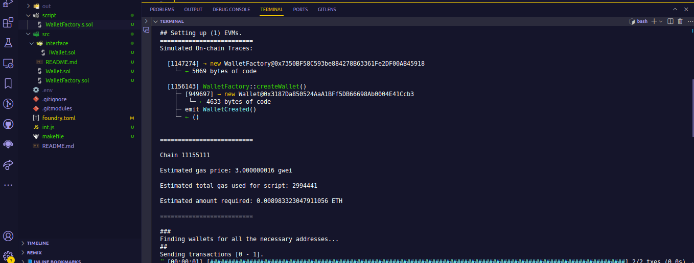
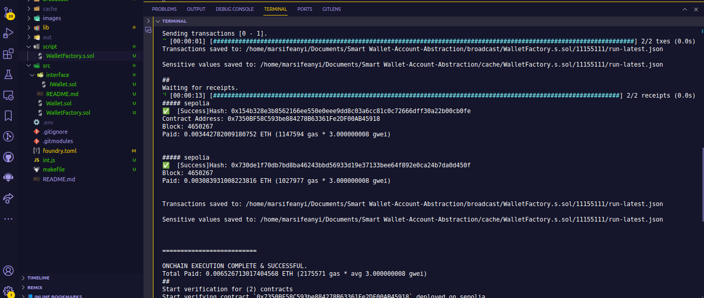
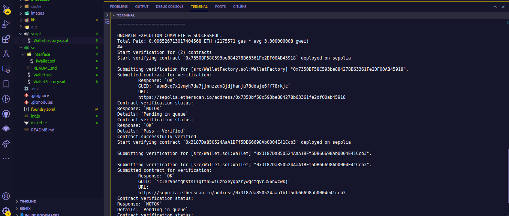
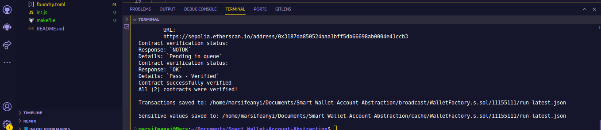

# Smart contract Wallet Account Abstraction

This project uses `ERC4337` standard to create Smart wallet for a user and also has functionalities that allows users to deposit funds, receive Fund, and view the Balance

## Table of Contents

- [Smart contract Wallet Account Abstraction](#smart-contract-wallet-account-abstraction)
  - [Table of Contents](#table-of-contents)
  - [Overview-Description](#overview-description)
  - [Deploying and Verifying the Contracts on Sepolia testnet](#deploying-and-verifying-the-contracts-on-sepolia-testnet)
  - [Verified Contract Addresses](#verified-contract-addresses)
  - [Frontend URL](#frontend-url)
  - [Authors](#authors)
  - [License](#license)

## Overview-Description

The project uses a `WalletFactory`, to create a smart contract `Wallet` for every user who wants to Create a Wallet.
The factory contract deploys instances of the child contract to create wallet for each user

## Deploying and Verifying the Contracts on Sepolia testnet

- 

- 

- 

- 

- 

## Verified Contract Addresses

- Wallet Contract:
  https://sepolia.etherscan.io/address/0x3187da850524aaa1bff5db66698ab0004e41ccb3

- WalletFactory Contract:
  https://sepolia.etherscan.io/address/0xfa90b61d3469e8e0130abcc4e41249e0fd4e4aa9

## Frontend URL

https://smart-walletc.vercel.app/

## Authors

Marcellus Ifeanyi
[@metacraftersio](https://twitter.com/Mars_Energy)

## License

This project is licensed under the MIT License - see the LICENSE.md file for details.
